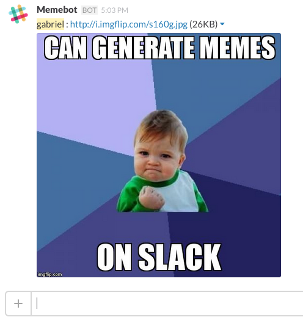
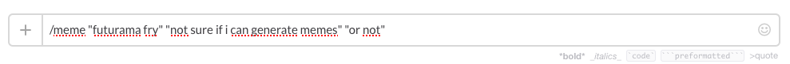
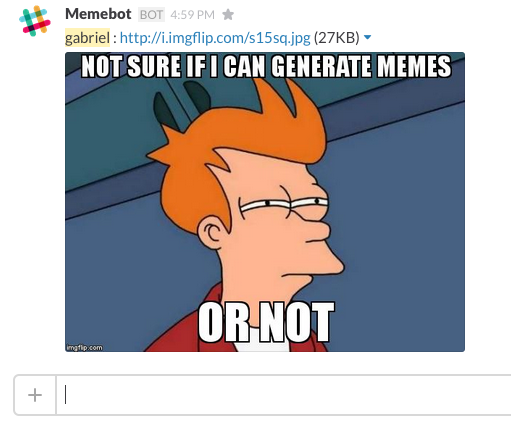

# Slack Meme

This is a slack bot that can generate memes.

This was done as part of a Hackday.

## Content

This uses [Imgflip](https://imgflip.com/)'s public API.

Therefore, you will need to create an account on their site to set up and use this script.

## Hosting

This can be hosted on anything, and just require to have it accessible online by Slack.

I used [Heroku](https://heroku.com) to host mine, as it's easy to configure and free!

The Slack meme script needs to access Imgflip's account credentials. Therefore, you have to set these following environment variables :
- *IMGFLIP_USERNAME*
- *IMGFLIP_PASSWORD*

(If you use Heroku, just set them as [config vars](https://devcenter.heroku.com/articles/config-vars)).

## Configuration

### Slack integration

You'll need to set up two integration services : *Incoming Webhooks* and *Slash command*.

#### Incoming Webhooks

You need to set it to a specific channel, but select whichever, it doesn't matter.

After validating, you'll be given a Webhook URL. Set this URL as *SLACK_URL* in your env / config variable.

#### Slash command

Enter */meme* as the command name.

Configuration parameter :
- URL: Set the URL that point to your live version of that script, with /meme at the end.
- Method: POST
- Usage hint : "meme name"  "top text"  ["bottom text"]

## Usage

Now, you can generate and post memes to Slack! Pretty neat, right?

Simply type : `/meme "meme name" "top text" "bottom text"`

If you want to see the list of available memes, type : `/meme` without arguments.

### Example

